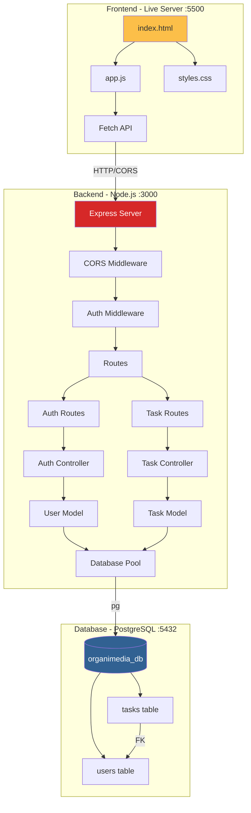
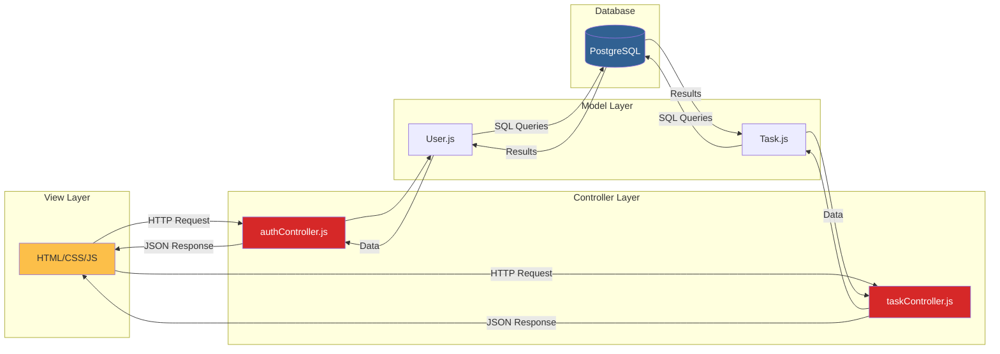
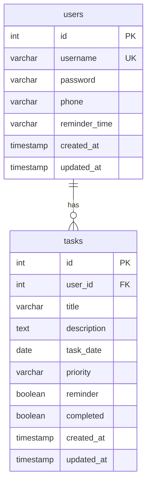
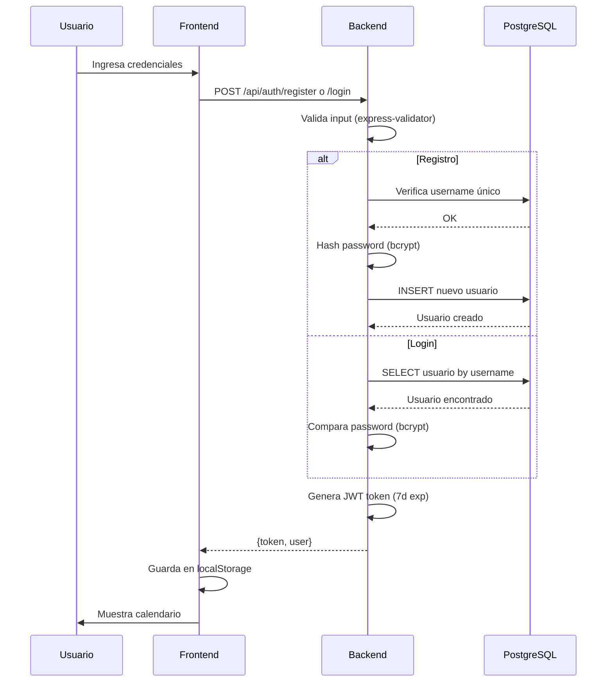
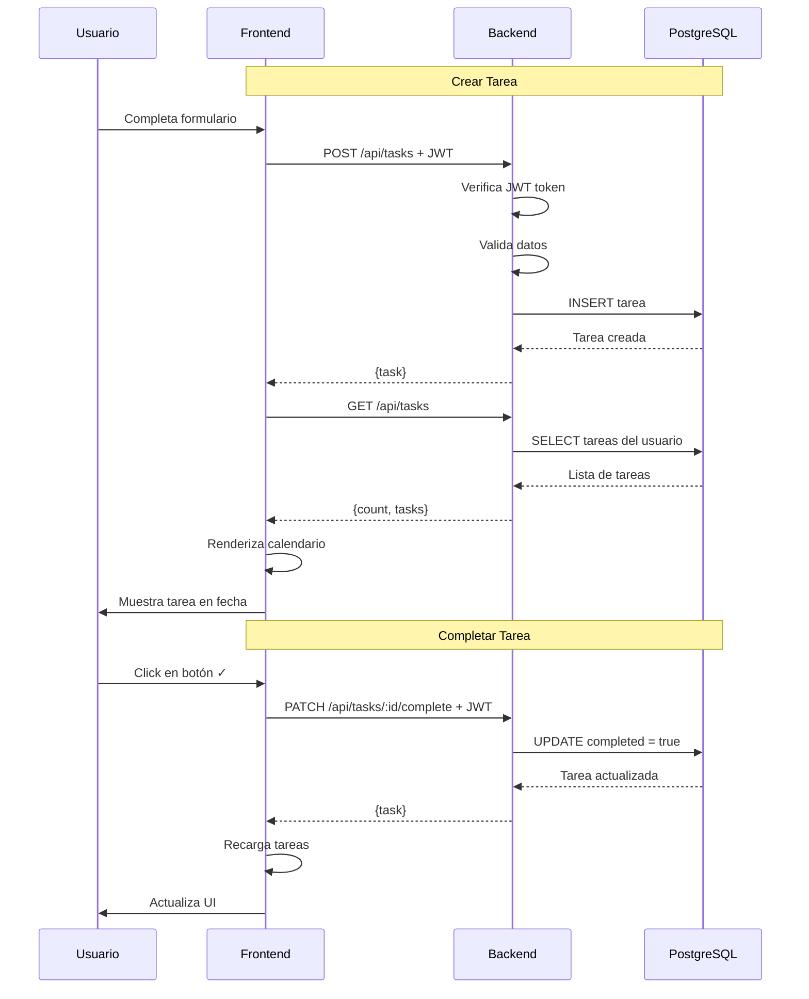
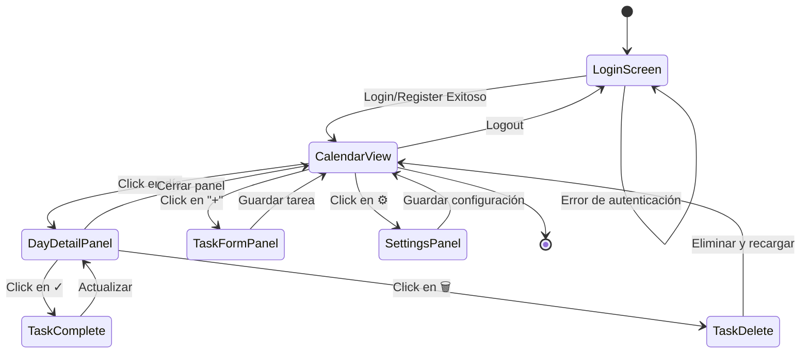

<div align="center">
  
# 📅 ORGANIMEDIA

### Sistema Profesional de Gestión de Tareas con Calendario Interactivo

[](https://nodejs.org/)
[](https://www.postgresql.org/)
[](https://expressjs.com/)
[](https://jwt.io/)

**Sistema completo de gestión de tareas empresarial con autenticación JWT, calendario interactivo, y recordatorios automatizados.**

[Características](#-características) • [Arquitectura](#-arquitectura) • [Instalación](#-instalación) • [Uso](#-uso) • [API](#-api-endpoints)

</div>

---

## 📑 Tabla de Contenidos

- [🎯 Características](#-características)
- [🏗️ Arquitectura](#️-arquitectura)
- [💾 Base de Datos](#-base-de-datos)
- [🔄 Flujo de la Aplicación](#-flujo-de-la-aplicación)
- [🚀 Instalación](#-instalación)
- [📖 Uso](#-uso)
- [🔌 API Endpoints](#-api-endpoints)
- [🛡️ Seguridad](#️-seguridad)
- [🧪 Testing](#-testing)
- [📝 Licencia](#-licencia)

---

## 🎯 Características

### 🎨 Frontend
- 📅 **Calendario Interactivo** - Vista mensual completa con navegación intuitiva
- 🎯 **Gestión de Tareas** - CRUD completo con prioridades (Alta/Media/Baja)
- 📱 **Diseño Responsive** - Optimizado para móviles, tablets y desktop
- 🎨 **Tema Personalizado** - Paleta de colores rojo (#d62828) y amarillo (#fcbf49)
- ⚡ **Actualización en Tiempo Real** - Sincronización automática con el servidor
- 🔍 **Vista Detallada** - Panel lateral con detalles de tareas por día

### 🔧 Backend
- 🔐 **Autenticación JWT** - Sistema seguro de tokens con expiración de 7 días
- 🗄️ **PostgreSQL** - Base de datos relacional con conexión pooling
- 🔒 **Bcrypt** - Encriptación de contraseñas con salting
- ✅ **Validación** - Express-validator para validación de entrada
- 📊 **Logging** - Sistema de logs detallado para queries y errores
- 🚦 **CORS** - Configuración múltiple de orígenes permitidos
- ⚡ **ES6 Modules** - Código moderno con import/export

### 🔔 Funcionalidades Avanzadas
- 📧 **Recordatorios** - Notificaciones 24h antes de cada tarea
- 📊 **Estadísticas** - Métricas de productividad y completitud
- 🏷️ **Prioridades** - Sistema de tres niveles (Alta/Media/Baja)
- ✅ **Estados** - Seguimiento de tareas completadas/pendientes
- 🔄 **Sincronización** - Actualización automática post-operaciones

---

## 🏗️ Arquitectura

### 📐 Diagrama de Arquitectura del Sistema



### 🔄 Patrón MVC (Model-View-Controller)



---

## 💾 Base de Datos

### 🗂️ Esquema de Base de Datos



### 📊 Características de las Tablas

**Tabla `users`:**
- Índice único en `username`
- Password hasheado con bcrypt (10 rounds)
- `reminder_time` por defecto: '11:00'
- Timestamps automáticos con triggers

**Tabla `tasks`:**
- Foreign key a `users(id)` con CASCADE
- Índices en `user_id`, `task_date`, `priority`
- Prioridades: 'low', 'medium', 'high'
- Timestamps automáticos con triggers

---

## 🔄 Flujo de la Aplicación

### 🔐 Flujo de Autenticación



### ✅ Flujo de Gestión de Tareas



### 📱 Flujo de la Interfaz de Usuario



---

## 🚀 Instalación

### 📋 Requisitos Previos

- **Node.js** 18+ ([Descargar](https://nodejs.org/))
- **PostgreSQL** 12+ ([Descargar](https://www.postgresql.org/download/))
- **Git** ([Descargar](https://git-scm.com/))
- **pgAdmin 4** (opcional, para gestión visual de BD)

### 1️⃣ Clonar el Repositorio

```bash
git clone https://github.com/sujeiizuni/organimedia.git
cd organimedia
```

### 2️⃣ Configurar Base de Datos

**Opción A: Crear manualmente en pgAdmin o psql**

```sql
CREATE DATABASE organimedia_db;
```

**Opción B: Usar el script de configuración automática**

```bash
cd backend
node scripts/setupDatabase.js
```

Este script:
- ✅ Crea la base de datos
- ✅ Genera tablas con constraints
- ✅ Crea índices optimizados
- ✅ Configura triggers para timestamps
- ✅ Inserta datos de ejemplo (opcional)

### 3️⃣ Configurar Backend

```bash
cd backend
npm install
```

**Crear archivo `.env` con tus credenciales:**

```env
# Servidor
NODE_ENV=development
PORT=3000
CORS_ORIGIN=http://localhost:5500

# PostgreSQL
DB_USER=postgres
DB_HOST=localhost
DB_NAME=organimedia_db
DB_PASSWORD=tu_contraseña_aqui
DB_PORT=5432
DB_POOL_MAX=20
DB_IDLE_TIMEOUT=30000
DB_CONNECTION_TIMEOUT=2000

# JWT
JWT_SECRET=tu_secreto_super_seguro_aqui_cambiar_en_produccion
JWT_EXPIRES_IN=7d

# Opcional: Twilio para SMS (futuro)
# TWILIO_ACCOUNT_SID=tu_account_sid
# TWILIO_AUTH_TOKEN=tu_auth_token
# TWILIO_PHONE_NUMBER=+1234567890
```

### 4️⃣ Iniciar Servidor Backend

```bash
# Desarrollo (con hot-reload)
npm run dev

# Producción
npm start
```

Deberías ver:
```
============================================================
🚀 ORGANIMEDIA BACKEND v2.0.0
============================================================
📡 Servidor: http://localhost:3000
🔧 Entorno: development
🗄️  Base de datos: PostgreSQL
============================================================
✅ Conexión a PostgreSQL establecida
✅ Base de datos verificada correctamente
```

### 5️⃣ Configurar Frontend

```bash
cd ../frontend
```

**Abrir con Live Server (VS Code):**
1. Instalar extensión "Live Server" de Ritwick Dey
2. Click derecho en `index.html`
3. Seleccionar "Open with Live Server"
4. Se abrirá en `http://127.0.0.1:5500` o `http://localhost:5500`

**Alternativa sin Live Server:**

```bash
# Usar http-server (instalar globalmente)
npm install -g http-server
http-server -p 5500
```

---

## 📖 Uso

### 🔐 Registro e Inicio de Sesión

1. **Registrar nuevo usuario:**
   - Username: Tu correo o nombre de usuario (permite @, ., números, letras)
   - Password: Mínimo 6 caracteres
   - Teléfono: 10-15 dígitos (para recordatorios futuros)

2. **Iniciar sesión:**
   - Usa tus credenciales
   - Token JWT válido por 7 días
   - Se guarda en `localStorage`

### ✅ Gestión de Tareas

#### Crear Tarea
1. Click en botón "+" en la barra superior
2. Completa el formulario:
   - **Título**: Nombre de la tarea (requerido)
   - **Descripción**: Detalles adicionales (opcional)
   - **Fecha**: Selecciona cuándo se debe realizar
   - **Prioridad**: Alta (rojo) / Media (amarillo) / Baja (gris)
   - **Recordatorio**: Activar para notificación 24h antes
3. Click en "Guardar Tarea"

#### Ver Tareas
- **Vista Calendario**: Muestra preview de hasta 2 tareas por día
- **Contador**: Indica total de tareas y cuántas están completadas
- **Click en día**: Abre panel lateral con todas las tareas de ese día

#### Completar Tarea
- Click en botón **✓** verde
- La tarea se marca como completada
- Se actualiza el contador automáticamente

#### Eliminar Tarea
- Click en botón **🗑️** rojo
- Confirma la eliminación
- Se elimina permanentemente de la base de datos

### ⚙️ Configuración

Click en el botón de engranaje (⚙️) para:
- Actualizar número de teléfono
- Cambiar hora de recordatorios (9:00 AM - 8:00 PM)
- Guardar preferencias

---

## 🔌 API Endpoints

### 📡 Autenticación

| Método | Endpoint | Descripción | Auth |
|--------|----------|-------------|------|
| `POST` | `/api/auth/register` | Registrar nuevo usuario | No |
| `POST` | `/api/auth/login` | Iniciar sesión | No |
| `GET` | `/api/auth/profile` | Obtener perfil del usuario | Sí |
| `PUT` | `/api/auth/profile` | Actualizar perfil | Sí |
| `DELETE` | `/api/auth/account` | Eliminar cuenta | Sí |

**Ejemplo Request - Registro:**
```json
POST /api/auth/register
Content-Type: application/json

{
  "username": "usuario@ejemplo.com",
  "password": "Password123",
  "phone": "5551234567"
}
```

**Ejemplo Response:**
```json
{
  "message": "Usuario registrado exitosamente",
  "token": "eyJhbGciOiJIUzI1NiIsInR5cCI6IkpXVCJ9...",
  "user": {
    "id": 1,
    "username": "usuario@ejemplo.com",
    "phone": "5551234567",
    "reminderTime": "11:00"
  }
}
```

### 📝 Tareas

| Método | Endpoint | Descripción | Auth |
|--------|----------|-------------|------|
| `GET` | `/api/tasks` | Listar todas las tareas del usuario | Sí |
| `POST` | `/api/tasks` | Crear nueva tarea | Sí |
| `GET` | `/api/tasks/:id` | Obtener tarea específica | Sí |
| `PUT` | `/api/tasks/:id` | Actualizar tarea completa | Sí |
| `PATCH` | `/api/tasks/:id/complete` | Marcar tarea como completada | Sí |
| `DELETE` | `/api/tasks/:id` | Eliminar tarea | Sí |
| `GET` | `/api/tasks/stats` | Estadísticas de tareas | Sí |

**Ejemplo Request - Crear Tarea:**
```json
POST /api/tasks
Authorization: Bearer {token}
Content-Type: application/json

{
  "title": "Reunión de proyecto",
  "description": "Revisión de avances con el equipo",
  "task_date": "2025-12-15",
  "priority": "high",
  "reminder": true
}
```

**Ejemplo Response:**
```json
{
  "message": "Tarea creada exitosamente",
  "task": {
    "id": 1,
    "user_id": 1,
    "title": "Reunión de proyecto",
    "description": "Revisión de avances con el equipo",
    "task_date": "2025-12-15T06:00:00.000Z",
    "priority": "high",
    "reminder": true,
    "completed": false,
    "created_at": "2025-12-11T10:30:00.000Z",
    "updated_at": "2025-12-11T10:30:00.000Z"
  }
}
```

### 🏥 Sistema

| Método | Endpoint | Descripción | Auth |
|--------|----------|-------------|------|
| `GET` | `/api` | Información de la API | No |
| `GET` | `/api/health` | Health check del servidor | No |

---

## 🛡️ Seguridad

### 🔐 Implementaciones de Seguridad

- **Bcrypt**: Hashing de contraseñas con 10 rounds de salting
- **JWT**: Tokens firmados con secreto, expiración de 7 días
- **Express-validator**: Validación y sanitización de todas las entradas
- **CORS**: Configuración restrictiva de orígenes permitidos
- **SQL Injection**: Prevención mediante queries parametrizadas (pg)
- **XSS**: Sanitización de inputs en frontend y backend
- **Password Policy**: Mínimo 6 caracteres, validación en cliente y servidor

### 🔒 Best Practices

```javascript
// ❌ NO HACER - Passwords en texto plano
const user = { password: 'mypassword123' };

// ✅ HACER - Hash con bcrypt
const hashedPassword = await bcrypt.hash(password, 10);
```

```javascript
// ❌ NO HACER - SQL Injection vulnerable
const query = `SELECT * FROM users WHERE username = '${username}'`;

// ✅ HACER - Queries parametrizadas
const query = 'SELECT * FROM users WHERE username = $1';
await pool.query(query, [username]);
```

---

## 🧪 Testing

### 🔍 Verificar Instalación

**1. Test de conexión a la base de datos:**
```bash
cd backend
node scripts/testConnection.js
```

**2. Test de endpoints con curl:**

```bash
# Health check
curl http://localhost:3000/api/health

# Registro
curl -X POST http://localhost:3000/api/auth/register \
  -H "Content-Type: application/json" \
  -d '{"username":"test@example.com","password":"Test123","phone":"5551234567"}'

# Login
curl -X POST http://localhost:3000/api/auth/login \
  -H "Content-Type: application/json" \
  -d '{"username":"test@example.com","password":"Test123"}'

# Crear tarea (reemplaza {TOKEN} con el token recibido)
curl -X POST http://localhost:3000/api/tasks \
  -H "Content-Type: application/json" \
  -H "Authorization: Bearer {TOKEN}" \
  -d '{"title":"Test Task","task_date":"2025-12-15","priority":"medium","reminder":false}'
```

**3. Test del frontend:**
```bash
# Abrir en navegador
http://127.0.0.1:5500/frontend/index.html

# Verificar en DevTools Console (F12):
# - No debe haber errores en consola
# - Debe ver logs: "📋 Tareas cargadas: X"
# - Network tab debe mostrar requests a localhost:3000
```

---

## 📁 Estructura del Proyecto

```
ORGANIMEDIA/
│
├── backend/
│   ├── config/
│   │   └── config.js              # Configuración centralizada
│   ├── controllers/
│   │   ├── authController.js      # Lógica de autenticación
│   │   └── taskController.js      # Lógica de tareas
│   ├── middleware/
│   │   ├── auth.js                # Middleware JWT
│   │   └── errorHandler.js        # Manejo de errores
│   ├── models/
│   │   ├── User.js                # Modelo de usuario
│   │   └── Task.js                # Modelo de tarea
│   ├── routes/
│   │   ├── authRoutes.js          # Rutas de auth
│   │   └── taskRoutes.js          # Rutas de tareas
│   ├── scripts/
│   │   └── setupDatabase.js       # Script de BD
│   ├── .env                       # Variables de entorno
│   ├── database.js                # Conexión PostgreSQL
│   ├── database.sql               # Schema SQL
│   ├── package.json               # Dependencias
│   └── server.js                  # Punto de entrada
│
├── frontend/
│   ├── app.js                     # Lógica de la aplicación
│   ├── index.html                 # Estructura HTML
│   └── styles.css                 # Estilos (inline en HTML)
│
└── README.md                      # Este archivo
```

---

## 🚀 Deployment

### 📦 Preparación para Producción

1. **Actualizar variables de entorno:**
```env
NODE_ENV=production
JWT_SECRET=un_secreto_completamente_aleatorio_y_seguro_de_al_menos_32_caracteres
CORS_ORIGIN=https://tu-dominio.com
```

2. **Configurar PostgreSQL en producción:**
- Usar servicios como: Railway, Render, Heroku Postgres, AWS RDS
- Actualizar credenciales en `.env`

3. **Deploy del Backend:**
```bash
# Ejemplo con Railway
railway login
railway init
railway up
```

4. **Deploy del Frontend:**
```bash
# Ejemplo con Vercel
npm install -g vercel
cd frontend
vercel --prod
```

5. **Actualizar API_BASE_URL en frontend:**
```javascript
// app.js - línea 1
const API_BASE_URL = 'https://tu-backend.railway.app/api';
```

---

## 🤝 Contribución

¡Las contribuciones son bienvenidas! Si deseas contribuir:

1. Fork el proyecto
2. Crea una rama para tu feature (`git checkout -b feature/AmazingFeature`)
3. Commit tus cambios (`git commit -m 'Add: nueva funcionalidad increíble'`)
4. Push a la rama (`git push origin feature/AmazingFeature`)
5. Abre un Pull Request

### 📝 Convenciones de Commits

- `Add:` Nueva funcionalidad
- `Fix:` Corrección de bugs
- `Update:` Actualización de funcionalidad existente
- `Refactor:` Refactorización de código
- `Docs:` Cambios en documentación
- `Style:` Cambios de formato/estilo
- `Test:` Agregar o actualizar tests

---

## 📧 Contacto

**Desarrollador:** Sujei Izuni  
**GitHub:** [@sujeiizuni](https://github.com/sujeiizuni)  
**Email:** sujei@cbtis258.edu.mx

---

## 📝 Licencia

Este proyecto está bajo la Licencia MIT. Ver archivo `LICENSE` para más detalles.

---

## 🙏 Agradecimientos

- **Node.js** - Runtime de JavaScript
- **PostgreSQL** - Sistema de base de datos robusto
- **Express.js** - Framework web minimalista
- **JWT** - Estándar de autenticación segura
- **Font Awesome** - Librería de iconos
- **Bcrypt** - Librería de hashing segura

---

<div align="center">

**⭐ Si te gusta este proyecto, dale una estrella en GitHub ⭐**

Made with ❤️ by Sujei Izuni

</div>
